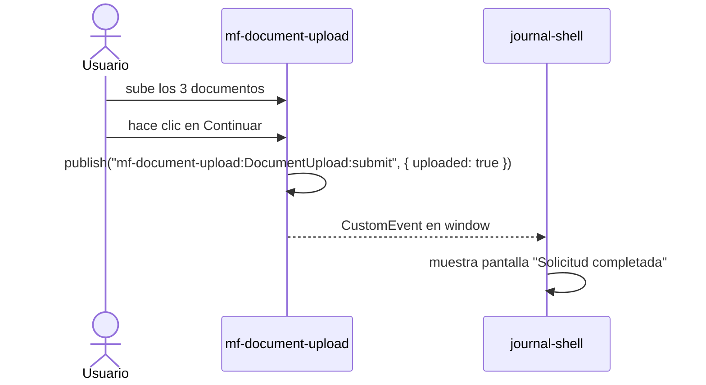

# mf-document-upload

**Angular 19 + Vite — Paso 4 del flujo de crédito hipotecario.**

Repositorio: [github.com/JairPrada/mf-document-upload](https://github.com/JairPrada/mf-document-upload)

Se monta en el shell después de que el usuario completa sus datos personales. Permite subir 3 documentos requeridos para la solicitud. Cuando los 3 están cargados, habilita el botón "Continuar" y emite el evento final del flujo.

---

## Componente: `DocumentUpload`

### Documentos requeridos

| Documento | Descripción |
|---|---|
| Identificación oficial | INE o Pasaporte |
| Comprobante de ingresos | Últimos 3 meses |
| Comprobante de domicilio | No mayor a 3 meses |

Cada ítem tiene un botón "Subir" que abre el selector de archivos del sistema operativo. Al seleccionar un archivo, el ítem se marca visualmente como cargado (borde azul, fondo azul claro). Los archivos **no se envían a ningún servidor**.

El botón "Continuar" se habilita cuando los 3 documentos están marcados.

---

## Evento que emite



| Evento | Payload |
|---|---|
| `mf-document-upload:DocumentUpload:submit` | `{ uploaded: boolean }` |

---

## Cómo funciona la integración con el shell

```html
"mf-document-upload": "http://localhost:3004/remoteEntry.js"
```

El shell llama:
```ts
hydrate("mf-document-upload", "DocumentUpload", containerEl, signal)
```

---

## Contrato de módulo (`src/index.ts`)

```ts
export default {
  manifest,
  async mount(el, _component, props) {
    // crea la aplicación Angular y monta DocumentUploadComponent en el
    const appRef = await createApplication();
    const componentRef = createComponent(DocumentUploadComponent, {
      environmentInjector: appRef.injector,
      hostElement: el,
    });
    appRef.attachView(componentRef.hostView);
  },
  unmount(el) {
    // llama appRef.destroy()
  },
}
```

Angular requiere `zone.js` y `@angular/compiler`. Ambos se importan en `src/index.ts` antes de crear la aplicación.

---

## CSS

Inyecta `remoteEntry.css` en el `<head>`. Las clases usan el prefijo `doc-`.

---

## Correr en local

```bash
pnpm build:contract
pnpm --filter mf-document-upload dev   # http://localhost:3004
```
